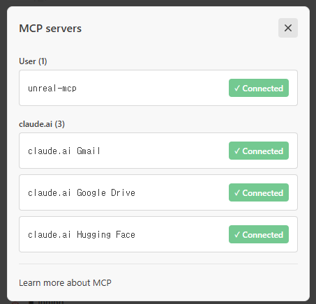

# Unreal Engine 5.8 + MCP + Claude Code·Codex 협업 셋업 가이드

> UE 5.8(2026-06-17, Unreal Fest Chicago 공개)에 내장된 **실험적(Experimental) Unreal MCP 플러그인**으로
> Claude Code 또는 Codex가 에디터를 직접 조작(액터 스폰·라이팅·머티리얼·블루프린트·레벨 편집·자동화 테스트)하도록 연결하는 절차.
>
> 대상 프로젝트: `C:\works\ue_prjs\MyProject` (UE 5.8 C++ 프로젝트)
> 플랫폼: Windows 11 / PowerShell

---

## 목차

- [0. 동작 원리 (한 장 요약)](#0-동작-원리-한-장-요약)
- [1. 사전 준비](#1-사전-준비)
- [2. 플러그인 활성화 (에디터)](#2-플러그인-활성화-에디터)
- [3. MCP 서버 설정 (자동 시작 켜기)](#3-mcp-서버-설정-자동-시작-켜기)
- [4. 클라이언트 설정 파일 생성 (.mcp.json)](#4-클라이언트-설정-파일-생성-mcpjson)
- [5. Claude Code와 Codex 연결](#5-claude-code와-codex-연결)
  - [방법 A — 자동 디스커버리 (권장)](#방법-a--자동-디스커버리-권장)
  - [방법 B — CLI 등록](#방법-b--cli-등록)
  - [방법 C — Claude Code에게 프롬프트로 맡기기](#방법-c--claude-code에게-프롬프트로-맡기기)
  - [연결 확인 (/mcp)](#연결-확인-mcp)
  - [연결 테스트 프롬프트](#연결-테스트-프롬프트)
  - [Codex 전역 등록](#codex-전역-등록)
- [6. 콘솔 명령 레퍼런스](#6-콘솔-명령-레퍼런스)
- [7. (선택) 에디터 내장 터미널에서 Claude 실행](#7-선택-에디터-내장-터미널에서-claude-실행)
- [8. 트러블슈팅](#8-트러블슈팅)
- [부록 A. 클라이언트 측 등록 심화 — 스코프와 전역(user) 단일화](#부록-a-클라이언트-측-등록-심화--스코프와-전역user-단일화)
- [부록 B. 새 프로젝트 자동 셋업 스크립트 (tools/Enable-UnrealMcp.ps1)](#부록-b-새-프로젝트-자동-셋업-스크립트-toolsenable-unrealmcpps1)
- [9. 출처 (2026-06 기준)](#9-출처-2026-06-기준)

---

## 0. 동작 원리 (한 장 요약)

```
┌────────────────────┐         HTTP / JSON-RPC          ┌──────────────────┐
│  Unreal Editor 5.8 │  http://127.0.0.1:8000/mcp        │   Claude Code    │
│  └ Unreal MCP 서버 │ ◀───────────────────────────────▶ │   (CLI 터미널)   │
│  └ AllToolsets     │   (loopback 전용, 인증 없음)       │ Claude Code/Codex│
│     = 실제 Tool들   │                                    │     MCP Client    │
└────────────────────┘                                    └──────────────────┘
```

핵심 사실:
- **MCP 서버가 에디터 프로세스 "안"에서 돈다.** 따라서 에디터가 켜져 있어야 Claude Code와 Codex가 붙는다.
- **Unreal MCP 플러그인 단독으로는 Tool이 없다.** `AllToolsets`(Toolset Registry) 플러그인을 켜야 실제 조작 Tool이 등록된다. → 안 켜면 "연결은 되는데 할 수 있는 게 없는" 상태가 된다.
- **전송 방식은 HTTP 전용** (stdio·WebSocket 미지원). 기본 바인딩 `127.0.0.1:8000`, 경로 `/mcp`.
- **Tool은 게임 스레드에서 순차 실행** → 동시 호출 겹치지 않게.

---

## 1. 사전 준비

| 항목 | 확인 |
|------|------|
| UE 5.8 설치 | Epic Games Launcher / GitHub 빌드 (2026-06-17 릴리스) |
| 프로젝트 엔진 버전 | `MyProject.uproject` → `"EngineAssociation": "5.8"` ✅ (이미 충족) |
| Claude Code CLI | 터미널에서 `claude --version` 동작 확인 |
| Codex CLI 또는 VS Code 확장 | 전역 MCP 등록은 `codex mcp` CLI로 수행 |
| 모델 | 복잡한 Blueprint 그래프 조작은 tool-calling 강한 모델 권장 (Opus/Sonnet) |

---

## 2. 플러그인 활성화 (에디터)

1. **Unreal MCP 켜기**
   - `Edit > Plugins` → 검색창에 **"Unreal MCP"** → `Enabled` 체크
   - 의존 플러그인 **"Toolset Registry"** 가 자동으로 함께 켜진다.
2. **AllToolsets 켜기 (필수 — 빼먹으면 Tool 0개)**
   - 같은 Plugins 창에서 **"Toolsets"** 또는 **"AllToolsets"** 검색 → `Enabled`
   - 기본 제공 Toolset: `SceneTools`, `ActorTools`, `MaterialInstanceTools`, `ObjectTools`
3. **에디터 재시작** (프롬프트가 뜨면 재시작)
   - C++ 프로젝트라 플러그인 모듈 빌드가 필요하면 재컴파일 프롬프트가 뜰 수 있음 → 빌드 진행.

> ⚠️ 모두 **Experimental** 표시. 프로덕션 빌드에는 주의.

---

## 3. MCP 서버 설정 (자동 시작 켜기)

1. `Edit > Editor Preferences > General > Model Context Protocol`
2. **`Auto Start Server`** 체크 → 에디터 켜질 때 서버 자동 기동
3. 기본값 확인/조정:
   - **Listening Port**: `8000`
   - **URL Path**: `/mcp`
   - 최종 엔드포인트: `http://127.0.0.1:8000/mcp`

수동 제어가 필요하면 콘솔 명령(아래 표) 사용.

---

## 4. 클라이언트 설정 파일 생성 (`.mcp.json`)

1. 에디터에서 콘솔 열기 — **백틱(`` ` ``)** 키
2. 다음 명령 실행:

   ```
   ModelContextProtocol.GenerateClientConfig ClaudeCode
   ```

3. **프로젝트 루트**(`C:\works\ue_prjs\MyProject\`)에 `.mcp.json` 이 생성된다:

   ```json
   {
     "mcpServers": {
       "unreal-mcp": {
         "type": "http",
         "url": "http://127.0.0.1:8000/mcp"
       }
     }
   }
   ```

- 여러 클라이언트를 한 번에: `ModelContextProtocol.GenerateClientConfig All`
- 지원 인자: `ClaudeCode`, `Cursor`, `VSCode`, `Gemini`, `Codex`, `All`

---

## 5. Claude Code와 Codex 연결

### 방법 A — 자동 디스커버리 (권장)

생성된 `.mcp.json` 이 있는 **프로젝트 루트에서** Claude Code를 실행한다:

```powershell
cd C:\works\ue_prjs\MyProject
claude
```

- Claude Code가 프로젝트 스코프 `.mcp.json` 을 자동 발견 → **MCP 서버 신뢰(approve) 프롬프트**가 뜨면 승인.
- 확인: Claude Code 안에서 `/mcp` 입력 → `unreal-mcp` 가 `connected` 로 보이면 성공 (캡처는 아래 [연결 확인](#연결-확인-mcp) 절).

### 방법 B — CLI 등록

```powershell
claude mcp add --transport http unreal-mcp http://127.0.0.1:8000/mcp
```

- `--scope` 를 지정하지 않으면 **local**(현재 폴더 + 내 머신 전용)로 등록된다.
  개인 PC에서 어느 폴더에서든 쓰려면 **전역(user) 등록** — [부록 A](#부록-a-클라이언트-측-등록-심화--스코프와-전역user-단일화) 참고.

### 방법 C — Claude Code에게 프롬프트로 맡기기

명령어를 외울 필요 없이, **Claude Code 세션에 아래 프롬프트를 그대로 붙여넣으면**
등록부터 검증까지 알아서 처리해 준다. 상황별 3종:

**① 등록 + 검증 — 전역(user) 스코프 (개인 PC 표준):**

> `unreal-mcp`(http://127.0.0.1:8000/mcp, http transport)를 **user(전역) 스코프**로 등록해줘.
> 다른 스코프(local/project)에 같은 이름이 있으면 정리하고, `claude mcp list`로 검증한 뒤,
> 현재 세션엔 재시작해야 반영된다는 점을 알려줘.

**② 연결이 안 될 때 — 진단 맡기기:**

> `unreal-mcp` 연결이 안 된다. ① `Test-NetConnection 127.0.0.1 -Port 8000`으로 서버 생존,
> ② `claude mcp get unreal-mcp`로 등록 스코프·상태, ③ 언리얼 에디터가 켜져 있는지(서버는
> 에디터 프로세스 안에서 돈다)를 순서대로 점검하고, 원인과 해결 방법을 알려줘.

**③ 새 프로젝트 에디터 측 셋업까지 맡기기 (부록 B 스크립트 활용):**

> `C:\works\ue_prjs\ready_unreal\tools\Enable-UnrealMcp.ps1` 을 `-Project "<프로젝트 경로>"`
> `-DryRun` 으로 먼저 실행해 변경 예정을 보여주고, 문제없으면 실제로 적용해줘.
> 끝나면 에디터 재시작이 필요하다는 점도 알려줘.

- 이름·포트·URL만 바꾸면 어떤 http MCP에도 그대로 쓰는 범용 지시문이다.
- 스코프 개념은 [부록 A-1](#a-1-등록-스코프-3종), ①의 원본 지시문은 [부록 A-6](#a-6-ai에게-맡기는-한-문장-복붙) 참고.

### 연결 확인 (`/mcp`)

Claude Code 세션에서 `/mcp` 를 입력하면 등록된 MCP 서버 목록과 연결 상태가 뜬다.
**`unreal-mcp ✓ Connected`** 가 보이면 성공이다.



- 위 캡처는 **부록 A의 전역(user) 등록**([A-4](#a-4-한방-레시피-복붙)) 상태라 `unreal-mcp` 가 **User** 그룹에 보인다.
  4~5장의 프로젝트(`.mcp.json`) 방식이면 **Project** 그룹으로 표시된다.
- 아래 **claude.ai** 그룹(Gmail·Google Drive·Hugging Face)은 claude.ai 계정에 딸려오는
  **원격 커넥터**로, 로컬 MCP와는 별개다 ([부록 A-7](#a-7-claudeai-커넥터--로컬-mcp) 참고).
- `failed` 로 보이면 에디터(=MCP 서버)가 꺼져 있는 경우가 대부분 → 에디터를 켜고
  `/mcp` 에서 리커넥트하면 된다.

### 연결 테스트 프롬프트

```
> 지금 선택된 액터가 뭐야?
> Unreal에서 네가 할 수 있는 일 몇 가지 알려줘
> 빈 레벨에 PointLight 하나 스폰하고 색온도 3200K로 맞춰줘
```

### Codex 전역 등록

Codex CLI와 VS Code 확장은 같은 사용자 전역 설정을 읽는다. 다음 명령을 한 번 실행하면,
어느 프로젝트를 열어도 `unreal-mcp`가 등록된 상태로 보인다.

```powershell
codex mcp add unreal-mcp --url http://127.0.0.1:8000/mcp
```

등록 확인:

```powershell
codex mcp list
```

기존 등록을 교체해야 하면 먼저 제거한 뒤 다시 등록한다.

```powershell
codex mcp remove unreal-mcp
```

등록 후에는 **VS Code 창을 다시 로드하고 새 Codex 대화**를 시작한다. `/mcp`에
`unreal-mcp`가 보이면 설정은 적용된 것이다.

`enabled`는 Codex 설정이 남아 있다는 뜻이다. 실제 도구 호출은 Unreal Editor가 실행 중이고
MCP 서버가 `127.0.0.1:8000`에서 열려 있을 때만 가능하다.

```powershell
Test-NetConnection 127.0.0.1 -Port 8000 -InformationLevel Quiet
```

`True`면 에디터 MCP 서버가 연결을 받을 준비가 된 상태다.

---

## 6. 콘솔 명령 레퍼런스

| 명령 | 용도 |
|------|------|
| `ModelContextProtocol.StartServer [port]` | 서버 수동 시작 |
| `ModelContextProtocol.StopServer` | 서버 중지 |
| `ModelContextProtocol.RefreshTools` | 커스텀 Toolset 작성 후 Tool 재등록 |
| `ModelContextProtocol.GenerateClientConfig <Client>` | 클라이언트 설정 생성 |

---

## 7. (선택) 에디터 내장 터미널에서 Claude 실행

별도 터미널 대신 에디터 안에서 돌리고 싶다면:

1. `Edit > Plugins` → **"Terminal"** 플러그인 활성화
2. `Editor Preferences > General > Terminal` 시작 명령 설정:
   - `set TERM=xterm-256color`  (Windows)
   - `cd "C:\works\ue_prjs\MyProject"`
   - `claude`

---

## 8. 트러블슈팅

| 증상 | 원인 / 해결 |
|------|-------------|
| Claude에 Tool이 하나도 안 보임 | **AllToolsets 미활성** → 2-2 단계 확인. 작성 후 `RefreshTools` 실행 |
| `Connection closed` / 연결 실패 | ① 에디터가 실제로 켜져 있고 서버가 떠 있는지(Output Log에서 bind 주소·포트 확인) ② `.mcp.json` 이 있는 **프로젝트 루트에서** `claude` 를 띄웠는지 |
| `/mcp` 에 unreal-mcp 안 뜸 | 실행 디렉터리에 `.mcp.json` 없음 → 4단계 재실행 또는 방법 B로 등록 |
| Codex `/mcp`에 unreal-mcp 안 뜸 | `codex mcp add unreal-mcp --url http://127.0.0.1:8000/mcp` 실행 후 VS Code 창을 다시 로드하고 새 대화 시작 |
| Codex에는 등록됐지만 연결 실패 | `Test-NetConnection 127.0.0.1 -Port 8000`으로 확인 → `False`면 Unreal Editor/MCP 서버 시작 |
| 포트 충돌 | Editor Preferences에서 포트 변경 후 `GenerateClientConfig` 재실행 (설정 파일도 갱신해야 함) |
| 복잡한 Blueprint 작업 실패 | tool-calling 약한 모델 → Opus/Sonnet 사용 |

---

## 부록 A. 클라이언트 측 등록 심화 — 스코프와 전역(user) 단일화

> 5장이 **프로젝트 단위**(`.mcp.json`) 연결이라면, 이 부록은 **개인 작업 PC에서 어느 폴더에서
> 세션을 열든 항상 쓰도록** 전역(user) 등록하는 방법이다. 명령 한 줄이면 끝난다.

### A-1. 등록 스코프 3종

같은 이름이 여러 스코프에 있으면 **우선순위 높은 것 하나만** 활성화된다.

| 스코프 | 저장 위치 (Windows) | 적용 범위 | 우선순위 | git 공유 |
|--------|---------------------|-----------|:--------:|:--------:|
| **local** | `~/.claude.json` 의 해당 프로젝트 항목 | 그 폴더만 | 1 (최상) | ✗ |
| **project** | 프로젝트 루트 `.mcp.json` (4장에서 생성) | 그 프로젝트만 | 2 | ✓ |
| **user** | `~/.claude.json` 최상위 `mcpServers` | **모든 프로젝트** | 3 | ✗ |

`~` = `C:\Users\<사용자>`. **개인 PC면 `user`(전역) 단일화**가 가장 편하다.

### A-2. 설정 파일 구분 (자주 헷갈림)

| 파일 | 담는 것 |
|------|---------|
| `~/.claude.json` | **MCP 서버 정의**(local·user) + 프로젝트별 상태 |
| `<프로젝트>/.mcp.json` | **MCP 서버 정의**(project) |
| `~/.claude/settings.json`, `.claude/settings.local.json` | **권한·env·hooks 전용 — MCP 정의 아님** |
| VSCode 자체 `settings.json` | VSCode 에디터 설정일 뿐, Claude Code MCP와 무관 |

> ⚠️ "Gmail 커넥터처럼 `settings.json`에 넣으면 되지 않나?"는 오해다. 로컬 MCP는
> `settings.json`이 아니라 `~/.claude.json`(또는 `.mcp.json`)에 등록한다.

### A-3. VSCode 확장도 CLI와 같은 파일을 읽는다 (핵심)

VSCode의 Claude Code 확장과 CLI는 **동일한 `~/.claude.json`을 공유**한다. 따라서
**CLI에서 `--scope user`로 한 번만 등록하면 VSCode 확장에서도 전역으로 적용**된다.
(확장 쪽 별도 설정 불필요.)

### A-4. 한방 레시피 (복붙)

```powershell
# 전역(user) 등록 + 즉시 검증 — 이 두 줄이면 끝
claude mcp add unreal-mcp --scope user --transport http http://127.0.0.1:8000/mcp
claude mcp list
```

→ 그다음 **Claude 세션만 새로 시작**하면 `/mcp`에 `unreal-mcp ✓ connected`
(캡처는 5장 [연결 확인](#연결-확인-mcp) 절 — User 그룹에 표시된다).

### A-5. 스코프 치트시트

```powershell
claude mcp add <name> -s user    -t http <url>   # 전역(모든 프로젝트)  ← 개인 PC 표준
claude mcp add <name> -s project -t http <url>   # 이 프로젝트만(.mcp.json, 팀 공유)
claude mcp add <name> -s local   -t http <url>   # 이 프로젝트 + 내 머신만(기본값)
claude mcp remove <name> -s <scope>              # 해당 스코프에서 제거
claude mcp list ; claude mcp get <name>          # 목록 / 스코프·상태 확인
```

`-s`=`--scope`, `-t`=`--transport`. stdio 서버는 `claude mcp add <name> -- <command> <args...>`
(`--` 뒤가 실행 명령).

### A-6. AI에게 맡기는 한 문장 (복붙)

명령을 외우기 싫으면 Claude Code에 그대로 붙여넣으면 알아서 처리한다:

> `unreal-mcp`(http://127.0.0.1:8000/mcp, http transport)를 **user(전역) 스코프**로 등록해줘.
> 다른 스코프(local/project)에 같은 이름이 있으면 정리하고, `claude mcp list`로 검증한 뒤,
> **현재 세션엔 재시작해야 반영된다는 점**을 알려줘.

포트/URL만 바꾸면 어떤 http MCP에도 쓰는 범용 지시문이다.

### A-7. claude.ai 커넥터 ≠ 로컬 MCP

- **커넥터**(Gmail·Google Drive·Hugging Face): claude.ai가 호스팅하는 **원격** 통합.
  설정 파일 어디에도 없고 **계정 로그인으로 자동 연결**된다.
- **로컬 MCP**(`unreal-mcp`): 내 머신에서 도는 서버. 위처럼 **명시적으로 등록**해야 한다.

### A-8. 자주 겪는 함정

| 증상 | 원인 / 해결 |
|------|-------------|
| 설정을 바꿨는데 현재 세션에 안 뜬다 | MCP는 **세션 시작 시 1회 로드** → Claude **재시작**해야 반영 |
| 폴더(프로젝트)에 따라 보였다 안 보였다 | local/project 스코프라 cwd 의존 → **user(전역) 단일화**로 해결 |
| 비(非)언리얼 프로젝트에서도 `unreal-mcp`가 뜸/연결 실패 경고 | 다른 프로젝트에 local 등록이 남아있음 → `claude mcp remove ... -s local` |

---

## 부록 B. 새 프로젝트 자동 셋업 스크립트 (`tools/Enable-UnrealMcp.ps1`)

> 2장~3장(플러그인 활성 + Auto Start Server)은 **프로젝트마다** 반복해야 한다.
> Claude Code(부록 A)와 Codex(5장)의 클라이언트 등록은 전역이라 1회면 끝나지만, **에디터 측(서버)** 은 프로젝트별
> 옵트인이기 때문이다. 이 반복을 명령 한 줄로 끝내는 스크립트다.

### B-1. 무엇을 하나 (멱등)

`.uproject` 를 안전하게 편집한다:

- `Plugins` 배열에 **`ModelContextProtocol`**(Unreal MCP 서버) + **`AllToolsets`**(조작 Tool 묶음) 추가.
  이미 있으면 건너뛰고, `Enabled:false` 면 `true` 로 고친다. 기존 다른 플러그인/필드는 보존.
- (기본) `Config/DefaultEditorPerProjectUserSettings.ini` 에 **자동시작** 설정을 기록:

  ```ini
  [/Script/ModelContextProtocolEngine.ModelContextProtocolSettings]
  bAutoStartServer=True
  ServerPortNumber=8000
  ServerUrlPath=/mcp
  ```

  → 다음부터 그 프로젝트를 **열기만 하면** MCP 서버가 `:8000` 에 자동 기동된다.

원본 `.uproject` 는 변경 시 타임스탬프 백업(`*.uproject.bak_YYYYMMDD_HHmmss`)을 남긴다.
엔진 내장 플러그인이라 **프로젝트 재컴파일은 없고 에디터 재시작만** 필요하다.
(출력 `.uproject` 의 들여쓰기는 스페이스로 정규화되지만 유효 JSON이며, UE가 다음 저장 때 탭으로 되돌린다.)

### B-2. 사용법

```powershell
# 프로젝트 폴더 또는 .uproject 경로를 넘긴다 (폴더면 .uproject 자동 탐색)
.\tools\Enable-UnrealMcp.ps1 -Project "C:\works\ue_prjs\MyNewProject"

# 미리보기 — 파일을 건드리지 않고 변경 예정만 출력
.\tools\Enable-UnrealMcp.ps1 -Project "C:\works\ue_prjs\MyNewProject" -DryRun

# 포트 변경 / 자동시작 생략(콘솔 StartServer 로 수동 기동할 때)
.\tools\Enable-UnrealMcp.ps1 -Project "C:\works\ue_prjs\MyNewProject" -Port 8123
.\tools\Enable-UnrealMcp.ps1 -Project "C:\works\ue_prjs\MyNewProject" -NoAutoStart
```

### B-3. 실행 후 (프로젝트당 한 번)

1. 그 프로젝트 에디터를 **재시작**(플러그인 모듈 로드). 자동시작을 켰으니 `:8000` 자동 기동.
   - 급하면 재시작 대신 실행 인자 **`-ModelContextProtocolStartServer`** 로도 즉시 기동된다.
2. Claude Code와 Codex 쪽은 **손댈 것 없음** — 전역 등록이 이미 되어 있으면,
   새 세션에서 `/mcp`로 `unreal-mcp` 연결을 확인한다.

> 검증: `Test-NetConnection 127.0.0.1 -Port 8000 -InformationLevel Quiet` (True면 서버 생존).

### B-4. 왜 엔진 차원 기본활성이 아니라 프로젝트별인가

`ModelContextProtocol` / `AllToolsets` 는 `EnabledByDefault:false` 인 **Experimental** 플러그인이고,
`ModelContextProtocol` 은 **Runtime 모듈**까지 포함해 엔진 차원으로 켜면 **패키징(배포) 빌드에도 딸려간다**.
그래서 프로젝트별 옵트인이 안전하며, 이 스크립트(또는 템플릿 프로젝트)로 반복 비용을 없앤다.

---

## 9. 출처 (2026-06 기준)

- [Unreal MCP in Unreal Editor — UE 5.8 공식 문서 (Epic)](https://dev.epicgames.com/documentation/unreal-engine/unreal-mcp-in-unreal-editor?lang=en-US)
- [UE 5.8 AI: Claude, Codex, MCP Editor Guide 2026 — explainx.ai](https://explainx.ai/blog/unreal-engine-5-8-claude-codex-mcp-ai-integration-2026)
- [Unreal Engine 5.8 Adds Claude and Gemini AI to Editor — techmymoney](https://techmymoney.com/2026/06/18/unreal-engine-5-8-connects-claude-and-gemini-directly-into-game-editors/)
- [The Impact of Unreal Engine 5.8's 'MCP Support' — note.com (香川友志)](https://note.com/kagawatomo/n/na6d10e54d4ee?hl=en)
- [UE5.8 MCP Server Setup & Test (YouTube)](https://www.youtube.com/watch?v=Ko3dy_G75-s)
- [Epic Dev Community 포럼 — Experimental UE 5.8 MCP Server "Connection Closed" 이슈](https://forums.unrealengine.com/t/testing-experimental-ue-5-8-mcp-server-with-local-llms-qwen-coder-and-claude-desktop-connection-closed-issue/2729403)
